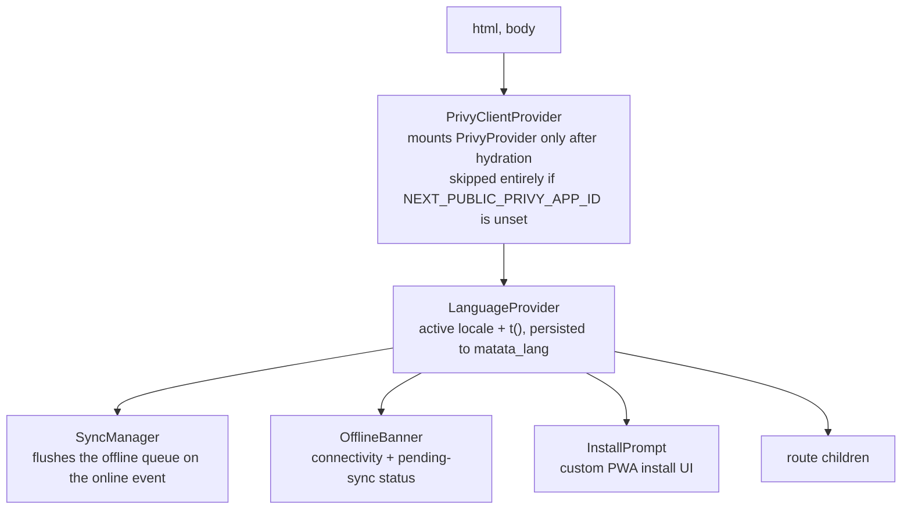
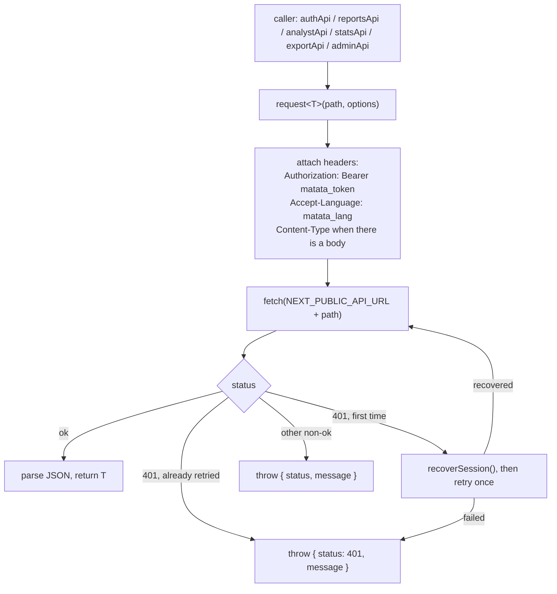
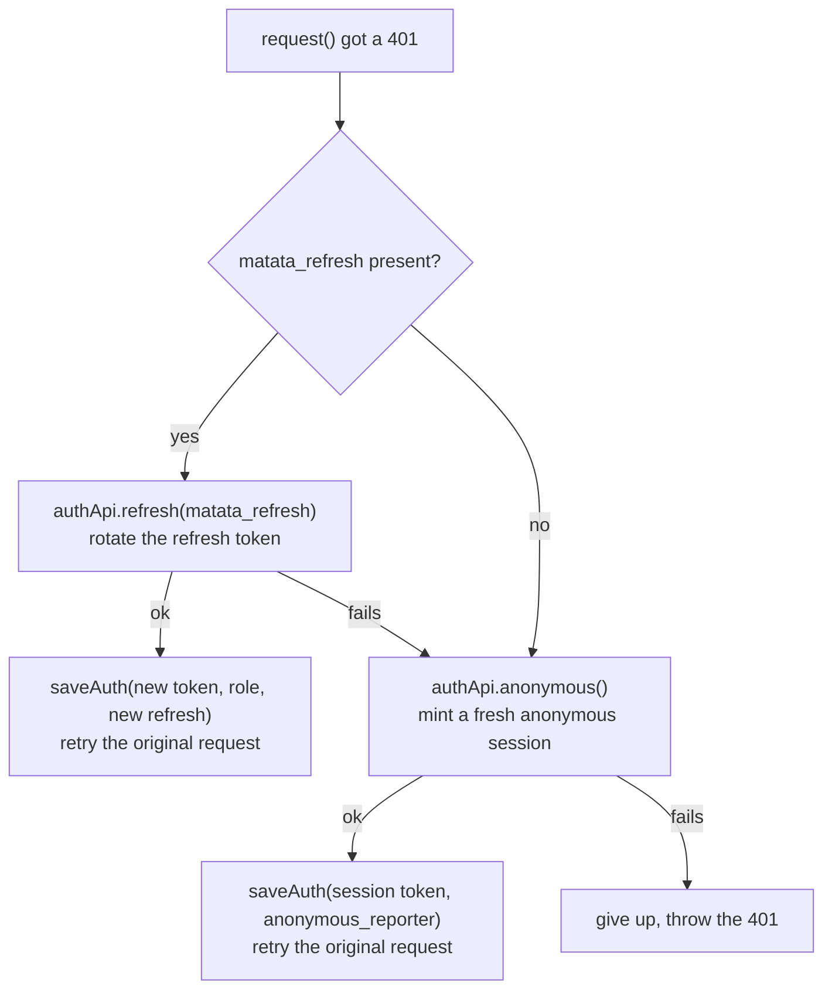
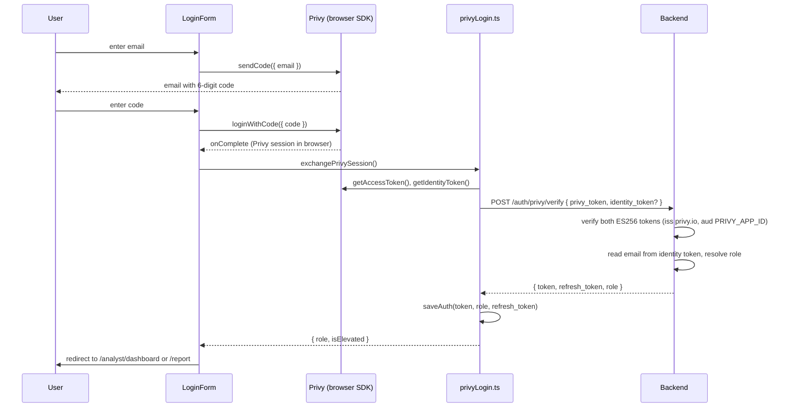
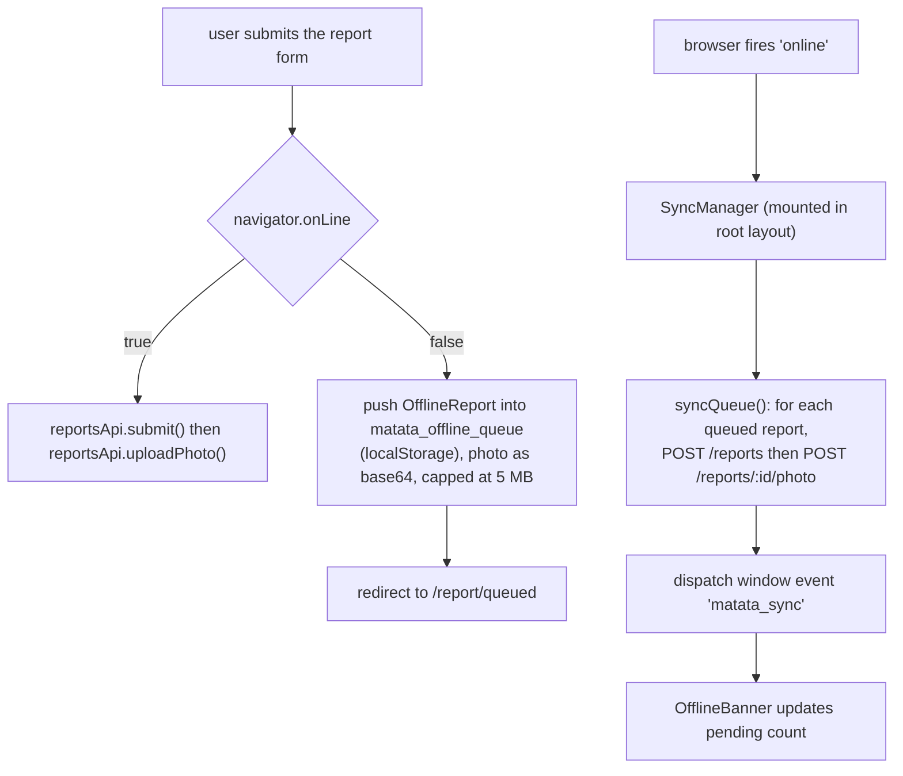
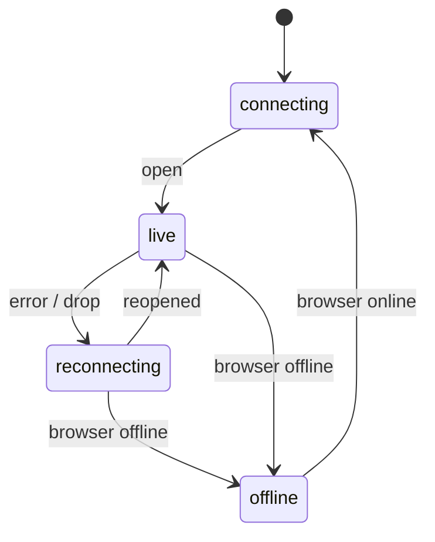

# Matata frontend architecture

This goes a level deeper than the [README](../README.md). It covers the
request lifecycle, the auth exchange, the offline queue, and the SSE
reconnection model, with diagrams. All paths are relative to `matata-app/`.

The app is a Next.js 16 App Router PWA. It holds no server session and does
no server-side authorization. Every piece of state that matters is either in
`localStorage` or fetched from the backend.

## Contents

- [Layout and providers](#layout-and-providers)
- [The API client](#the-api-client)
- [Session recovery on 401](#session-recovery-on-401)
- [Auth exchange sequence](#auth-exchange-sequence)
- [Offline queue lifecycle](#offline-queue-lifecycle)
- [Analyst SSE stream](#analyst-sse-stream)
- [Internationalization typing](#internationalization-typing)
- [State ownership](#state-ownership)

## Layout and providers

`src/app/layout.tsx` wraps every route in a fixed provider stack:

`PrivyClientProvider` is first because the login screens need Privy context,
but it must not run during static prerendering (the provider validates its
app ID against the network). It renders its children unchanged on the server
and the first client paint, then mounts `PrivyProvider` in a `useEffect`.
The login forms are `dynamic(ssr: false)` imports, so by the time they call
`useLoginWithEmail` the provider is up.

The analyst portal adds its own client-side gate in
`src/app/analyst/layout.tsx` and the SSE provider in
`AnalystStreamContext.tsx`, scoped to `/analyst/*` only.

## The API client

Every backend call goes through `request<T>()` in `src/lib/api.ts`. Nothing
in the app calls `fetch` directly.

Two things to keep in mind when writing catch blocks:

- Errors are thrown as plain objects `{ status, message }`, not `Error`
  instances. Every catch in the app does `err as { status?: number }`.
- The retry on 401 is transparent and happens at most once per call. A
  caller never sees the first 401.

## Session recovery on 401

`recoverSession()` is what makes the anonymous flow feel seamless when a
token expires mid-session.

A signed-in analyst whose refresh token is dead falls through to an
anonymous session and the retried request 401s again on a protected
endpoint, which the portal treats as "session lost" and sends them to
`/analyst/login`.

## Auth exchange sequence

Login is Privy's hosted email OTP in the browser, then a single exchange at
our backend. The three entry points (anonymous reporter, email reporter,
provisioned analyst) all end in the same `saveAuth()` call.

If `variant="analyst"` and the resolved role is not elevated, `LoginForm`
calls `clearAuth()` and `clearPrivySession()` and shows "contact your
administrator" instead of redirecting.

If the Privy app has identity tokens turned off, `getIdentityToken()` throws
and is caught; the exchange sends `privy_token` only and the backend issues
a plain reporter session.

## Offline queue lifecycle

The report form is fully usable with no connection (`src/lib/offline.ts`).

`OfflineReport.fields` must stay in sync with the field names
`reportsApi.submit` and `reportsApi.uploadPhoto` send, because `syncQueue()`
posts those names directly.

## Analyst SSE stream

`useAnalystStream.ts` opens an `EventSource` to `GET /analyst/stream` and is
shared app-wide through `AnalystStreamContext.tsx`.

Typed events (`report.created`, `report.updated`, `report.critical`,
`report.ai_divergence`, see `AnalystStreamEvent` in `src/lib/types.ts`) push
updates to dashboards and the sidebar connection indicator without polling.
The sidebar also polls `statsApi.summary()` every 60 seconds for the
merge-review badge count, as a supplement to the stream, not a replacement.

## Internationalization typing

English is the source of truth for translation keys. `translations/en.ts`
exports the `TranslationKey` union; every other locale dictionary is typed
`Record<TranslationKey, string>`, so a missing or misspelled key in `fr.ts`
or `ar.ts` is a compile error, not a silent English fallback at runtime
(though `t()` does fall back to English, then to the raw key, at runtime as a
last resort).

Add a key to `en.ts` first, then fill it in the other nine locales.

## State ownership

| State | Where it lives | Lifetime |
|---|---|---|
| Session token, refresh token, role | `localStorage` (`matata_*`) | until logout or expiry |
| Active locale | `localStorage` (`matata_lang`) | until changed |
| Offline report queue | `localStorage` (`matata_offline_queue`) | until synced |
| Privy browser session | `localStorage` (`privy:*`) | until `clearPrivySession()` |
| SSE connection status | React context (`AnalystStreamContext`) | per page load |
| Everything else (reports, stats, accounts) | fetched from the backend, not cached | per request |

There is no client-side data store (no Redux, no React Query). Lists are
refetched on navigation and nudged live by SSE events.
